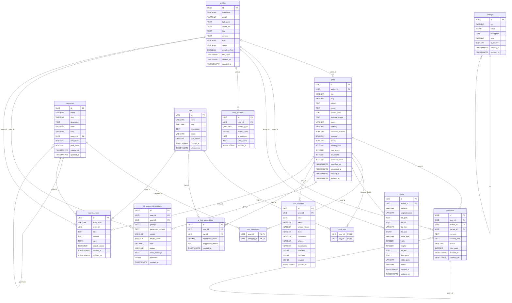

# Blog-MCP 数据库 ER 图

## 📊 实体关系概览

## 🗂️ 表关系详解

### 核心实体关系

#### 1. 用户 → 文章 (一对多)
- 一个用户可以发布多篇文章
- 每篇文章属于一个用户
- 关系字段：`posts.author_id` → `profiles.id`

#### 2. 文章 → 评论 (一对多)
- 一篇文章可以有多条评论
- 每条评论属于一篇文章
- 支持嵌套评论（评论的评论）
- 关系字段：`comments.post_id` → `posts.id`

#### 3. 文章 → 分类 (多对多)
- 一篇文章可以有多个分类
- 一个分类可以包含多篇文章
- 通过 `post_categories` 关联表实现

#### 4. 文章 → 标签 (多对多)
- 一篇文章可以有多个标签
- 一个标签可以附加到多篇文章
- 通过 `post_tags` 关联表实现

#### 5. 分类 → 分类 (自引用一对多)
- 支持分类的层级结构
- 一个分类可以有多个子分类
- 关系字段：`categories.parent_id` → `categories.id`

#### 6. 评论 → 评论 (自引用一对多)
- 支持评论的嵌套回复
- 一条评论可以有多条回复
- 关系字段：`comments.parent_id` → `comments.id`

### 扩展实体关系

#### 7. 用户 → 媒体文件 (一对多)
- 一个用户可以上传多个媒体文件
- 每个媒体文件属于一个用户
- 关系字段：`media.author_id` → `profiles.id`

#### 8. 用户 → 活动记录 (一对多)
- 一个用户可以有多条活动记录
- 每条活动记录属于一个用户
- 关系字段：`user_activities.user_id` → `profiles.id`

#### 9. 文章 → AI 内容生成 (一对多)
- 一篇文章可以有多个 AI 生成记录
- 每个 AI 生成记录属于一个用户和一篇文章
- 关系字段：`ai_content_generations.post_id` → `posts.id`

#### 10. 文章 → 统计数据 (一对多)
- 一篇文章可以有多天的统计数据
- 每条统计记录属于一篇文章
- 关系字段：`post_analytics.post_id` → `posts.id`

## 🔍 索引策略

### 主要索引
1. **主键索引**: 所有表的 UUID 主键
2. **外键索引**: 所有外键字段
3. **唯一索引**: 用户名、邮箱、文章 slug 等唯一字段
4. **复合索引**: 常用查询组合

### 全文搜索索引
- `posts` 表的全文搜索索引
- `search_index` 表的 GIN 索引

### 性能索引
- 按时间排序的索引
- 按状态过滤的索引
- 按计数排序的索引

## 📊 数据统计

### 表数量统计
- **核心业务表**: 6 个 (profiles, posts, categories, tags, comments, media)
- **关联表**: 2 个 (post_categories, post_tags)
- **系统表**: 2 个 (user_activities, settings)
- **搜索表**: 1 个 (search_index)
- **AI 相关表**: 2 个 (ai_content_generations, ai_tag_suggestions)
- **分析表**: 1 个 (post_analytics)
- **总计**: 14 个表

### 关系复杂度
- **一对多关系**: 8 个
- **多对多关系**: 2 个
- **自引用关系**: 2 个

## 🚀 性能优化建议

### 1. 查询优化
- 使用适当的索引避免全表扫描
- 限制复杂 JOIN 查询的深度
- 使用分页查询大数据集

### 2. 缓存策略
- 缓存热门文章和用户数据
- 缓存分类和标签列表
- 使用 CDN 缓存静态资源

### 3. 分区考虑
- 大表按时间分区
- 统计数据表按日期分区
- 活动记录表按月份分区

### 4. 监控指标
- 查询响应时间
- 索引使用率
- 数据库连接数
- 表空间使用情况

## 🔐 安全考虑

### 1. 数据保护
- 所有敏感字段加密存储
- 使用 Row Level Security (RLS)
- 定期备份数据

### 2. 访问控制
- 基于角色的访问控制
- API 请求频率限制
- SQL 注入防护

### 3. 审计日志
- 记录用户操作日志
- 监控异常访问行为
- 定期安全审计